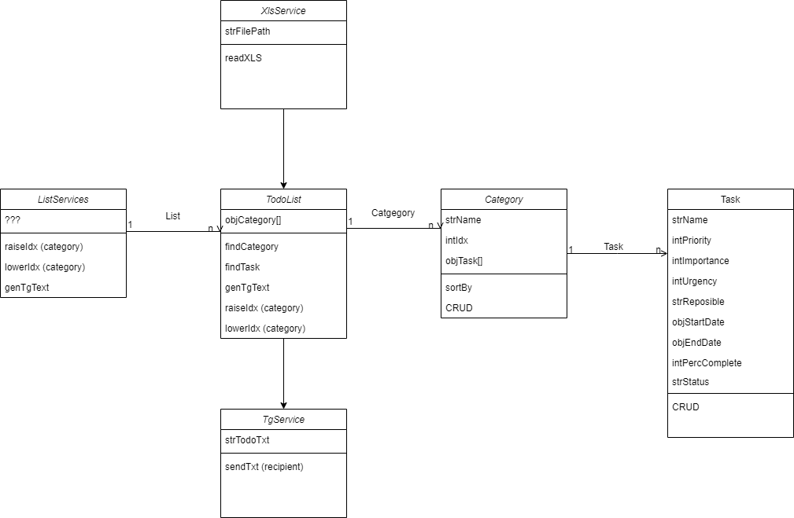
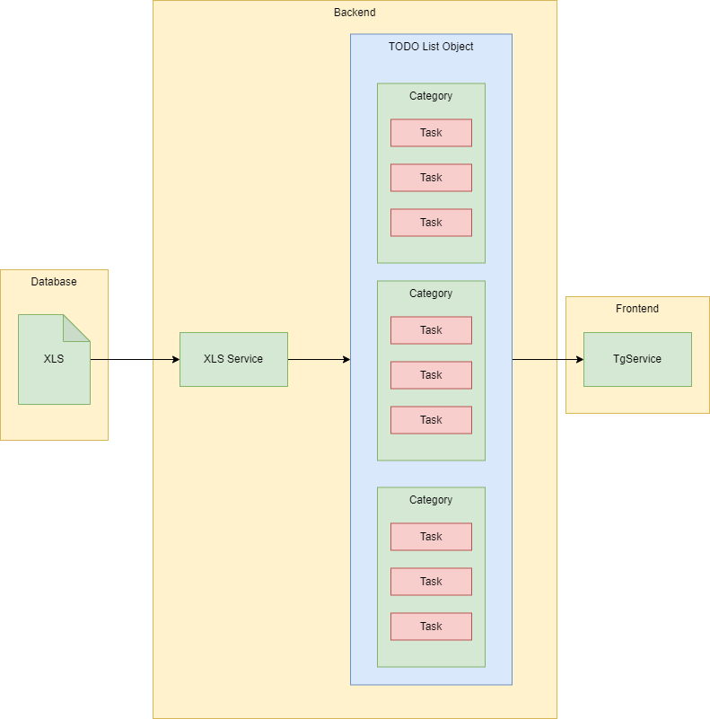

#XLS TODO Enhancer

##Problem
The simplest way to manage a project is a TODO list. Using an excel spreadsheet is good way to visualize the spreadsheet. However, different people have different preferences when it comes to intrepreting TODO task and Excel is not the most legible in a mobile phone. 

As such a mobile friendly frontend is to be developed for the TODO List enhancer

## Prequisite

1) install nodejs
2) install yarn
3) install nest
4) free port 5000 (if not free, need to change configuration)
5) OO Design thinking
6) Swagger Documentation


## Assumptions
1) Understanding of the Client Server 3 Tier Architecture
2) Understanding of Node JS

## BE Configuration

For Port Change
```bash
export PORT=XXXXXX
export XLS_LOCATION=XXXXXX
```

## Overview

Class Diagram


Architecture


## Run Server
```bash
yarn
yarn start:debug
```

## Key Endpoints
